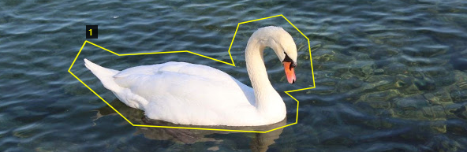

# VGG-VIA_TIKIT_Tools

## Introduction
* This is an implementation of [Mask R-CNN](https://arxiv.org/abs/1703.06870) on Python 3, Keras, and TensorFlow. 
* Mainly about Data preprocessing of [VGG Image Annotator](http://www.robots.ox.ac.uk/~vgg/software/via/).
* Key package:
    1. skimage
    2. shapely
    3. json
    4. opencv

## Important Issue
* Suitable for beginner who are learning VIA Data.
* Since the latest Mask R-CNN supports VGG version 1.60. Its label format is quite different from the latest version 2.0.12. Please check your VIA version before applying this repository.
* This repository is coded mainly towards labels of Instance Segmentation, and I am not sure whether it could work well on other kinds of label formats. 
* This repository will be further updated (2023.02.27).

## Code Catalogue & Abstract
###   VGG_expand.py
    This code is used to expand images' scale randomly and generate new VGG labels for Data Augmentations
    Offer both sample function and batch processing function
###   VGG_rotate.py
    This code is used to rotate the original images at random angles and generate new VGG labels for Data Augmentations.
    Offer both sample function and batch processing function
###   VGG_TO_MASK_IMG.py
    This code is used to transfer labels into mask png for Semantic Segmentation
    Offer batch processing function

###   VGG_visualize.py
    This code is used to visialize labels of example image
    Offer sample function only

### More details will be introduced in code annotations.

## Special thanks
Technical Support&Consultant:
[@Kitakitan](https://github.com/stream2000)    

Institute: [Urban Mobility Institute of Tongji Uni](https://umi.tongji.edu.cn/index.htm)
